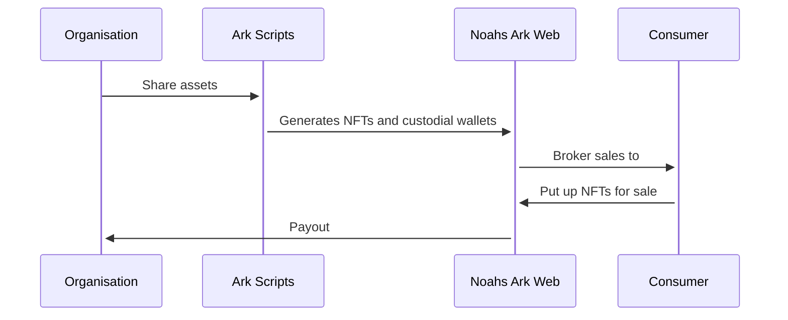

# Amata Ark Demo

This repository contains the source code necessary to run the Amata Ark Demo

## Technical Architecture

The repository contains a series of projects necessary to demonstrate how the
problem will be addressed. The following diagram illustrates the process:



Since we will be working with non-technical organisations, we will act as the
intermediary that ingests assets (such as images, flavour text, etc.) that we
can convert into NFTs. We will then work with these organisations to settle on
the number of NFTs to distribute and the appropriate initial sales price.

From there, we have a set of scripts defined in the [scripts](/scripts/) folder
that will generate the NFTs based on the assets.

## Technologies used

The entire stack is primarily driven by Typescript, with React/Next.js on the
frontend and a Node environment to run the scripts. The entire monorepo is
managed using Yarn and the workspaces feature.

## Quick start

To run a local development version, you will need:

- A [Firebase](https://firebase.google.com/) service account credentials. Name
  the file `firebase-credentials.json` and put it in the `frontend/` directory

Once complete, you can run the app using:

```
yarn workspace @amata-ark-demo/frontend dev
```

To generate the seed data, you will also need to:

- Generate a wallet for a broker account to represent the service and
  marketplace. You can use the quickstart templates to get started.
- Create an account on [nft.storage](https://nft.storage/) and generate an API
  key. This is used to store the assets on IPFS.
- Create a `.env` file in the `/scripts/` folder with your details, use the
  sample provided [here](/scripts/.env.sample) for guidance.
- Make sure you have generated the `firebase-credentials.json` file as per the
  frontend instructions

Once complete, you can now generate the data:

```
yarn workspace @amata-ark-demo/scripts seed
```

## Deployment

This repo supports deploying to a [Vercel](https://vercel.com/) environment, all you need is to generate a deployment token and run the following command:

```
VERCEL_TOKEN=<YOUR_DEPLOYMENT_TOKEN> yarn workspace @amata-ark-demo/frontend deploy
```